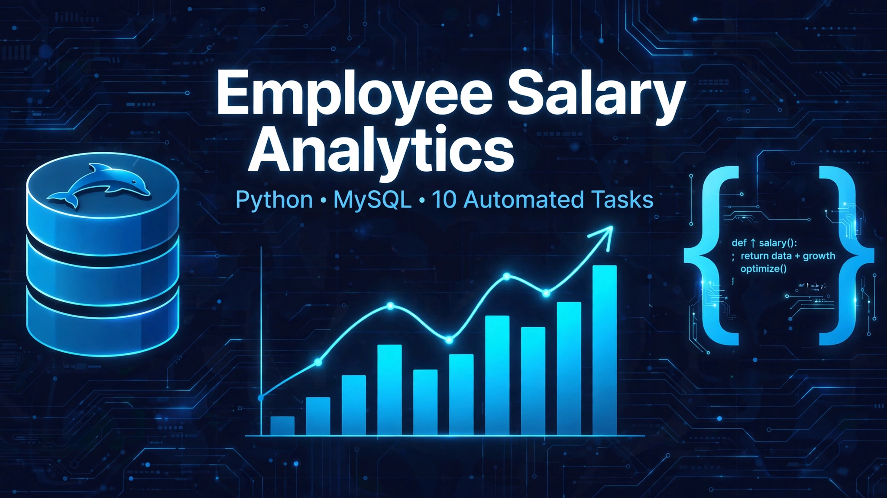

# 💼 Employee Salary Analytics

<p align="center">
  
</p>

<p>
  
  
  
</p>

A **Python + MySQL** project that runs **10 automated salary-analysis tasks** over an
employee database — salary bands, department bonuses, tax, performance bonuses,
increments, incentives and summary tables, all in one script.

## ✨ What it does

Connects to MySQL (database `empolyee`, table `employee_db`) and executes 10 tasks:

| # | Task | Details |
|---|------|---------|
| 1 | Salary categorization | Labels each employee **High** (≥ ₹50,000), **Medium** (≥ ₹40,000) or **Low** salary |
| 2 | Department bonus | IT **15%**, Sales **10%**, others **8%** — prints bonus and final salary |
| 3 | Tax calculation | **10%** tax on salaries ≥ ₹50,000, else **5%** — shows after-tax salary (above ₹40,000) |
| 4 | Performance bonus | Department score (IT 90, Sales 80, others 75) mapped to a **15% / 10% / 5%** bonus |
| 5 | Summary table | Writes per-employee bonus and final salary into a new `employee_summary` table |
| 6 | Department totals & averages | Total and average salary for **IT, HR and Sales** |
| 7 | Promotion eligibility | Flags employees earning ≥ ₹50,000 as eligible for promotion |
| 8 | Salary increment | Calculates incremented salary by department — IT **12%**, Sales **10%**, others **8%** |
| 9 | Incentive table | Writes slab-based incentives (**₹5000 / ₹3000 / ₹2000**) into `employee_incentive` |
| 10 | Salary range | Highest salary, lowest salary, and the difference between them |

## 🗂 Project structure

```
Employee-Salary-Analytics/
├── Solution.py            # Main script — all 10 tasks
├── Supporting_Dataset.sql # Sample dataset (creates DB + table + rows)
├── requirements.txt       # Python dependencies
└── README.md
```

## 🚀 Quickstart

```bash
# 1. Load the sample dataset into MySQL
mysql -u root -p < Supporting_Dataset.sql

# 2. Install dependencies
pip install -r requirements.txt

# 3. Run — you will be asked for your MySQL password (via getpass, never hardcoded)
python Solution.py
```

## 🛠 Tech

Python · MySQL · SQL · mysql-connector-python

## 👤 Author

**Saurabh Jadhav** — B.Sc. (CBZ), 2026 · Python / SQL / Power BI / Machine Learning

- GitHub: https://github.com/saurabh77-sys
- LinkedIn: https://www.linkedin.com/in/saurabh-jadhav-8492151a9
- Portfolio: https://saurabh77-sys.github.io/
